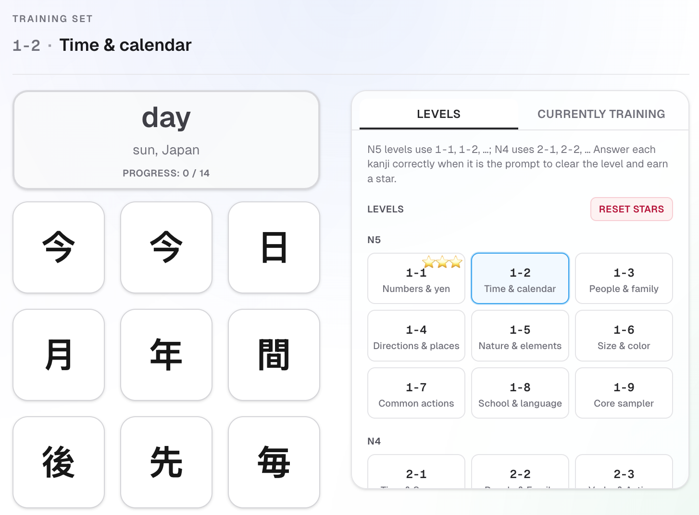

# Kanji Smash

Whack-a-mole style kanji training

## Initial Kanji

The training set starts with the first **12** unique kanji from the deck (API order). Additional kanji can enter when a slot opens (see **Training strategy**).

## Success and failure

When the user selects the correct answer, the kanji is given a green pip.  
When the user selects the wrong answer, the kanji is given a red pip.

A kanji can have at most **8** pips shown.  
Once it reaches 8, new pips overwrite the oldest ones.

## Stars (level completion)

Each training set ("level") can earn **up to 3 stars**, based on how clean the run was:

- **⭐ (1 star)**: you completed the run (cleared the level) with **2+ wrong guesses**
- **⭐⭐ (2 stars)**: you completed the run with **exactly 1 wrong guess**
- **⭐⭐⭐ (3 stars)**: **perfect** run (0 wrong guesses)

Wrong guesses are counted across the run until the level is completed.
You can replay a level to try to earn more stars.

## Training strategy

Each round shows an English **meaning**; the player picks the matching kanji from a grid.

### Who becomes the prompt?

Among kanji that are **not resting** (see below), the app picks the next meaning prompt at random using **weights**:

- **Wrong pips:** each red pip on a kanji adds to its weight, so kanji you struggle with show up as the prompt more often.
- **Spacing:** each round you have not seen that kanji as the meaning prompt adds a small extra weight, capped so the session still mixes characters instead of only chasing mistakes.
- The **previous** prompt is avoided when there is another choice.

If every kanji in the pool is resting, the app falls back and may pick any of them.

### Resting after a strong streak

If the pip strip for a kanji ends with **three green pips in a row** (three correct rounds in a row where that kanji was the target), that kanji **rests**: it is not chosen as the meaning prompt for a fixed number of rounds (the count ticks down after each round).

- If there is another kanji in the deck not yet in the active set, it **takes that slot** while the mastered kanji is listed as on break.
- If there is no such kanji, the mastered kanji stays in the roster but still rests (cooldown) until the timer ends.

### UI

- **Currently training:** the active roster, with resting timers where applicable.
- **On break:** kanji that were swapped out while a new deck character uses their slot.
- **Outside training:** kanji that are neither in the current training set nor on break (e.g. not yet reached in the deck).
